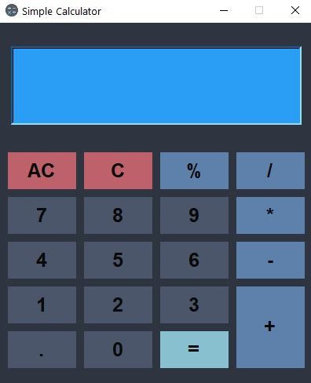

# Simple Calculator

This is a simple calculator project created with Python and the Tkinter library.

**Features**

- Graphical interface with Tkinter
- Basic operations: addition, subtraction, multiplication, division, and percentage
- Stylized button design
- Support for decimal numbers
- Option to delete a single digit or clear the screen completely

**Requirements**

-To run this project, you need to have Python 3.11 installed.

**Installation and Execution**

- Clone this repository.
- Navigate to the project directory.
- Run the main script.

**Usage**

- Enter numbers and select an operation using the buttons.
- Press the = button to get the result
- Use C to delete a single digit and AC to clear the screen completely.

**Screenshot**

**Contributions**

- If you would like to improve this project, feel free to fork it and submit a pull request.
